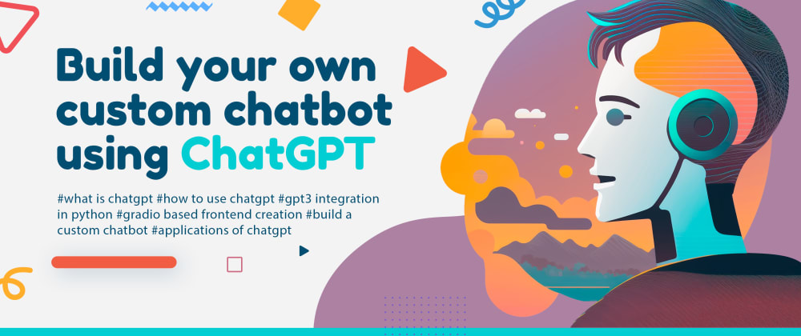

# Custom CHATGPT Bot

To understand how to generate and use your OpenAPI Key visit:

https://medium.com/@shashank01123/how-to-generate-and-use-openai-api-key-8307144fe21d

To understand full code in a story visit:

https://medium.com/@shashank01123/building-a-custom-chatbot-with-openai-api-a-journey-of-conversational-intelligence-with-your-own-8da8bc22e291

in the UI, flagged is to flag the irrelevant answers which will get saved automatically in flagged directory with a csv file, which we can analyze further to improve the answers by adding more detailed and clear documents under training_documents
 
